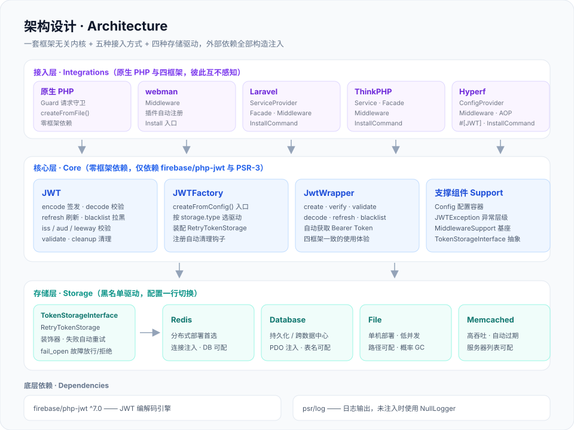
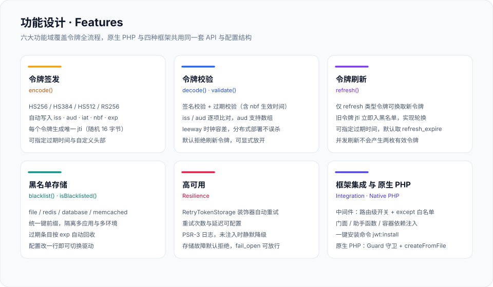
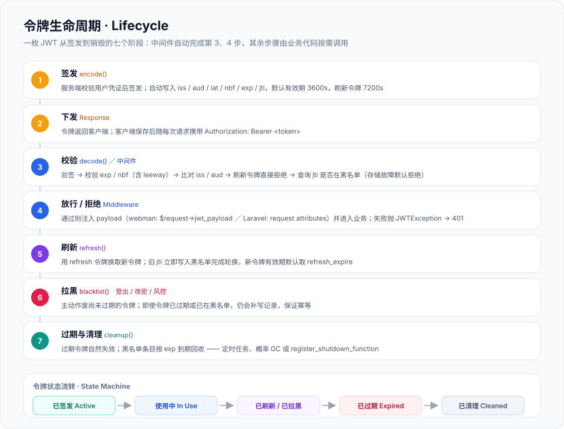

# erikwang2013/jwt-webman

一款兼容 webman、Laravel、ThinkPHP、Hyperf 的 JWT 认证插件，也能直接在原生 PHP（无框架）项目中使用。一套框架无关内核 + 五种接入方式 + 四种可插拔黑名单存储，适用于分布式部署，安装简单快捷。

<div align="center">
  
  <br />
  <sub>项目宠物 · <b>钥匙小卫 Kee</b> —— 钥匙柄是框架无关内核，刃上四颗齿是四个框架适配层，胸前盾牌是校验与黑名单</sub>
</div>

作者：[艾瑞可erik](https://erik.xyz)

## 项目说明

`erikwang2013/jwt-webman` 是一个 PHP 多框架 JWT 认证插件，核心基于 `firebase/php-jwt` 封装。

### 定位

传统的 JWT 插件通常只绑定单一框架，在微服务或多项目架构中，不同框架之间需要各自对接不同的 JWT 实现，造成维护成本和认证逻辑不一致的风险。

本插件将核心逻辑与框架完全解耦，通过「一套核心 + 接入层」的架构，在原生 PHP 与 webman、Laravel、ThinkPHP、Hyperf 中提供一致的 API 体验。无论后端服务使用哪个框架，JWT 的编码、解码、刷新、黑名单逻辑完全一致，只需按照各框架的习惯方式进行配置和注入即可；不带框架的项目可以直接使用内核与 `Native\Guard` 请求守卫。

### 架构

整体分为「接入层 → 框架无关内核 → 可插拔存储层」四层，依赖单向向下，任何一层都能独立替换：



核心层不依赖任何框架 helper，所有外部依赖（配置、日志、数据库连接、Redis 连接）通过构造函数或工厂方法注入。每个框架的适配层负责从框架容器中获取这些依赖，组装后传入核心工厂。逐文件的目录说明见 [项目结构](#项目结构)。

### 设计理念

- **框架无关核心**：核心代码零框架依赖，可在任何 PHP 8.0+ 项目中使用
- **原生深度集成**：每个框架适配层遵循各自的插件规范和惯用写法，而非生硬地统一封装
- **统一配置格式**：五种接入方式共用一套配置结构，仅环境变量读取方式略有不同（原生 PHP 用 `getenv()`）
- **存储驱动可插拔**：黑名单支持 file / redis / database / memcached 四种后端，通过配置切换
- **渐进式接入**：可从最简单的 file 存储起步，业务增长后无缝切换到 redis 或 database

## 项目结构

```
jwt-webman/
├── src/erik-jwt/                    核心与五种接入方式（约 2400 行）
│   ├── JWT.php                      核心：令牌编解码、刷新、黑名单、清理
│   ├── JwtWrapper.php               核心：便捷封装，自动获取 Bearer Token
│   ├── JWTFactory.php               核心：工厂，按配置/配置文件组装内核与存储
│   ├── Config.php                   核心：框架无关的配置容器与 PHP 配置文件加载
│   ├── TokenStorageInterface.php    核心：黑名单存储抽象接口
│   ├── JWTException.php             核心：异常层级（配置 / 无效 / 过期 / 黑名单 / 存储）
│   ├── MiddlewareSupport.php        核心：中间件共用的 except 白名单匹配
│   ├── Mascot.php                   宠物：终端横幅 banner() 与矢量形象 svg()
│   ├── RedisTokenStorage.php        存储：Redis（注入 callable 连接）
│   ├── DatabaseTokenStorage.php     存储：数据库（注入 PDO，兼容静默错误模式）
│   ├── FileTokenStorage.php         存储：文件系统（路径可配、概率 GC）
│   ├── MemcachedTokenStorage.php    存储：Memcached
│   ├── RetryTokenStorage.php        装饰器：存储操作失败自动重试
│   ├── Install.php                  webman 插件安装入口（安装时打印宠物横幅）
│   ├── Native/                      接入层：Guard 请求守卫 + 无框架配置模板
│   ├── Webman/                      接入层：Middleware
│   ├── Laravel/                     接入层：ServiceProvider · Facade · Middleware · InstallCommand
│   ├── ThinkPHP/                    接入层：Service · Facade · Middleware · InstallCommand
│   ├── Hyperf/                      接入层：ConfigProvider · Middleware · AOP Aspect · InstallCommand
│   └── config/                      随包分发的各框架默认配置
├── tests/                           225 个用例：核心、五种接入、存储驱动、签名安全
│   └── stubs/                       四框架最小化替身，无需安装框架即可跑测试
├── docs/                            文档与图形资源
│   ├── pet.svg                      项目宠物「钥匙小卫 Kee」
│   ├── architecture.svg             架构设计图
│   ├── features.svg                 功能设计图
│   ├── lifecycle.svg                令牌生命周期图
│   ├── test-report.md               测试报告
│   └── review-report-20260802.md    代码审查报告
├── examples/usage.php               框架无关的可运行示例
├── composer.json                    包定义与 PSR-4 自动加载
└── phpunit.xml.dist                 测试配置
```

## 架构设计


| 层 | 职责 | 约束 |
|------|------|------|
| **接入层** | 原生 PHP 用 `Native\Guard` 守卫请求；四框架从各自容器取配置与连接，组装核心实例 | 五种接入方式互不感知，核心不反向依赖任何一方 |
| **框架无关内核** | 令牌编解码、刷新、黑名单、异常分级 | 零框架 helper，仅依赖 `firebase/php-jwt` 与 PSR-3 |
| **可插拔存储层** | 黑名单读写、过期回收、故障策略 | 只认 `TokenStorageInterface`；驱动与 `fail_open` 由配置决定 |
| **底层依赖** | JWT 编解码引擎与日志 | 日志未注入时用 `NullLogger` 静默降级 |

## 功能设计



## 令牌生命周期



一枚令牌从签发到销毁共七个阶段：**签发 → 下发 → 校验 → 放行 / 拒绝 → 刷新 → 拉黑 → 过期与清理**。其中第 3、4 步由中间件（原生 PHP 下是 `Native\Guard`）自动完成，其余步骤由业务代码按需调用。刷新采用轮换策略——旧 `jti` 在换发新令牌的同时进入黑名单，因此同一枚刷新令牌不会被重复使用；新令牌的有效期默认取 `refresh_expire`。

## 功能特性

- JWT 令牌生成（支持 HS256 / HS384 / HS512 / RS256 算法）
- 令牌验证（支持时间容差 leeway）
- 刷新令牌（Refresh Token，轮换时旧 jti 自动入黑名单）
- 令牌黑名单（支持 redis、database、memcached、file 四种存储驱动）
- 存储操作失败自动重试，故障时可配置放行或拒绝
- 原生 PHP 直接可用：`Guard` 请求守卫 + 配置文件加载，零框架依赖
- 四框架深度集成：中间件、门面模式、安装命令

## 安装

```sh
composer require erikwang2013/jwt-webman
```

## JwtWrapper 便捷封装

自 `v1.1.0` 起，提供了一个 `JwtWrapper` 便捷封装类，简化常见操作并支持自动从请求头获取 Token：

```php
use Erikwang2013\Jwt\JwtWrapper;

$jwt = new JwtWrapper(JWTFactory::createFromConfig(
    config('plugin.erikwang2013.jwt.jwt'),
    null,
    [
        'redis' => fn() => \support\Redis::connection(),
        'pdo'   => \support\Db::connection()->getPdo(),
    ]
));

// 生成令牌
$token = $jwt->create(['user_id' => 1]);

// 生成令牌并指定过期时间（秒）
$token = $jwt->create(['user_id' => 1], 7200);

// 验证令牌，返回 payload 对象
$payload = $jwt->verify($token);
echo $payload->user_id;

// 不传令牌时自动从请求头读取（$_SERVER / getallheaders，含重写转发的头部）
$payload = $jwt->verify();

// 仅验证不返回 payload
if ($jwt->validate($token)) { ... }

// 解码令牌（不校验有效性）
$data = $jwt->decode($token);

// 刷新令牌（自动从 Authorization 头获取当前 token）
$newToken = $jwt->refresh();

// 或手动传入 token 刷新
$newToken = $jwt->refresh($oldToken);

// 拉黑令牌
$jwt->blacklist($token);

// 检查令牌是否在黑名单
if ($jwt->isBlacklisted($token)) { ... }
```

适用所有框架，只需将 `JWTFactory::createFromConfig()` 替换为对应框架的创建方式即可。

## 原生 PHP（无框架）使用

核心不依赖任何框架 helper，原生 PHP 项目两步即可接入。

**1. 复制配置模板**（纯 `getenv()`，不调用任何框架函数）：

```sh
cp vendor/erikwang2013/jwt-webman/src/erik-jwt/Native/config/jwt.php config/jwt.php
```

**2. 入口处创建守卫并校验请求：**

```php
require __DIR__ . '/vendor/autoload.php';

use Erikwang2013\Jwt\Native\Guard;

$guard = Guard::fromFile(__DIR__ . '/config/jwt.php');

// 校验失败时输出与四框架中间件完全一致的 401 JSON 并结束请求
$payload = $guard->requireAuth();
$userId  = $payload['user_id'];
```

需要自行决定响应方式时，改用 `authenticate()` 或 `check()`：

```php
use Erikwang2013\Jwt\JWTException;

try {
    $payload = $guard->authenticate();   // 自动读取 Authorization: Bearer
} catch (JWTException $e) {
    // JWTException::userMessage($e) 是对外安全的提示文案
    http_response_code(401);
    echo json_encode(['code' => 401, 'msg' => JWTException::userMessage($e), 'data' => null]);
    exit;
}

if ($guard->check()) { /* 只判断有效性，不处理异常 */ }
```

**签发、刷新、拉黑：**

```php
$jwt = $guard->getJWT();

$token   = $jwt->encode(['user_id' => 1]);                              // 访问令牌
$refresh = $jwt->encode(['user_id' => 1, 'token_type' => 'refresh']);   // 刷新令牌
$new     = $jwt->refresh($refresh);                                     // 换发并拉黑旧令牌
$jwt->blacklist($token);                                                // 登出
$jwt->cleanup();                                                        // 建议放进定时任务
```

**注入存储连接**（redis / database / memcached 驱动）：

```php
$jwt = \Erikwang2013\Jwt\JWTFactory::createFromFile(__DIR__ . '/config/jwt.php', null, [
    'pdo'   => new PDO('mysql:host=127.0.0.1;dbname=app', $user, $pass),
    'redis' => fn() => new Redis(),   // 传 callable，首次使用时才建立连接
]);
```

**不使用 composer 时**：命名空间遵循 PSR-4，把 `src/erik-jwt` 映射到 `Erikwang2013\Jwt\` 前缀即可（`spl_autoload_register` 或自建 classmap），运行时依赖只有 `firebase/php-jwt` 与 `psr/log`。

> 包内的全局助手函数 `jwt()` 服务于 Laravel / ThinkPHP（内部调用 `app('erik.jwt')`），原生 PHP 项目请使用 `JWTFactory` / `Guard`。若项目自身也定义了 `jwt()` 且先于 composer 自动加载执行，可从 `composer.json` 的 `autoload.files` 中移除对应的 `helpers.php`。

## 各框架使用说明

### Webman

`composer require` 后通过 webman 插件系统自动注册，无需手动配置。

**配置文件：** `config/plugin/erikwang2013/jwt/jwt.php`

**基本用法：**

```php
use Erikwang2013\Jwt\JWTFactory;

$jwt = JWTFactory::createFromConfig(
    config('plugin.erikwang2013.jwt.jwt'),
    null,
    [
        'redis' => fn() => \support\Redis::connection(),
        'pdo'   => \support\Db::connection()->getPdo(),
    ]
);

// 生成令牌
$token = $jwt->encode(['user_id' => 1]);

// 验证令牌
$payload = $jwt->decode($token);

// 拉黑令牌
$jwt->blacklist($token);
```

**中间件：** 在 `config/middleware.php` 中注册：

```php
return [
    '' => [
        \Erikwang2013\Jwt\Webman\Middleware::class,
    ],
];
```

在控制器中获取解析后的 payload：

```php
$payload = $request->jwt_payload;
$userId  = $payload['user_id'];
```

---

### Laravel

`composer require` 后通过 `extra.laravel` 自动发现 ServiceProvider。如果关闭了自动发现，手动在 `config/app.php` 中注册：

```php
'providers' => [
    Erikwang2013\Jwt\Laravel\JWTServiceProvider::class,
],
```

**安装命令：**

```sh
php artisan jwt:install
```

执行后会自动发布配置文件并生成 `JWT_SECRET_KEY` 写入 `.env`。

**配置文件：** `config/jwt.php`

**门面方式：**

```php
use Erikwang2013\Jwt\Laravel\Facade as JWT;

$token   = JWT::encode(['user_id' => 1]);
$payload = JWT::decode($token);
JWT::blacklist($token);
```

**辅助函数：**

```php
$token = jwt()->encode(['user_id' => 1]);
```

**依赖注入：**

```php
use Erikwang2013\Jwt\JWT;

public function __construct(JWT $jwt) {
    $this->jwt = $jwt;
}
```

**中间件：**

```php
// 路由中使用
Route::middleware('jwt')->group(function () {
    Route::get('/api/user', [UserController::class, 'index']);
});

// 控制器中获取 payload
public function index(Request $request) {
    $payload = $request->attributes->get('jwt_payload');
    $userId  = $payload['user_id'];
}
```

**手动发布配置：**

```sh
php artisan vendor:publish --tag=jwt-config
```

---

### ThinkPHP

`composer require` 后在 `app/service.php` 中注册服务：

```php
return [
    \Erikwang2013\Jwt\ThinkPHP\JWTService::class,
];
```

**安装命令：**

```sh
php think jwt:install
```

**配置文件：** `config/jwt.php`

**门面方式：**

```php
use Erikwang2013\Jwt\ThinkPHP\JWT;

$token   = JWT::encode(['user_id' => 1]);
$payload = JWT::decode($token);
```

**辅助函数：**

```php
$token = jwt()->encode(['user_id' => 1]);
```

**中间件：**

```php
// 路由中使用
Route::group(function () {
    Route::get('/api/user', 'UserController@index');
})->middleware('jwt');

// 控制器中获取 payload
public function index(Request $request) {
    $payload = $request->jwt_payload;
    $userId  = $payload['user_id'];
}
```

---

### Hyperf

`composer require` 后在 `config/autoload/dependencies.php` 中注册 ConfigProvider：

```php
return [
    \Erikwang2013\Jwt\Hyperf\ConfigProvider::class,
];
```

**安装命令：**

```sh
php bin/hyperf.php jwt:install
```

**配置文件：** `config/autoload/jwt.php`

**依赖注入：**

```php
use Erikwang2013\Jwt\JWT;
use Hyperf\Di\Annotation\Inject;

class UserController {
    #[Inject]
    protected JWT $jwt;

    public function index() {
        $token   = $this->jwt->encode(['user_id' => 1]);
        $payload = $this->jwt->decode($token);
    }
}
```

**中间件：** ConfigProvider 已自动注册，在 `config/autoload/middlewares.php` 中配置即可。走中间件的路由用请求属性读 payload：

```php
$payload = $request->getAttribute('jwt_payload');
```

**AOP 注解方式（可选）：**

```php
use Erikwang2013\Jwt\Hyperf\JWT as JWTAuth;
use Hyperf\Context\Context;

class UserController {
    #[JWTAuth]
    public function index() {
        // 方法执行前自动校验 JWT；AOP 走协程上下文传递 payload
        $payload = Context::get('jwt_payload');
    }
}
```

---

## 配置文件参考

```php
return [
    // 签名密钥，至少 32 字符（256 位，firebase/php-jwt v7 的硬性要求）
    'secret_key'     => env('JWT_SECRET_KEY', ''),
    // 签名算法：HS256 / HS384 / HS512 / RS256
    'algorithm'      => env('JWT_ALGORITHM', 'HS256'),
    // 签发者标识
    'issuer'         => env('JWT_ISSUER', ''),
    // 受众标识
    'audience'       => env('JWT_AUDIENCE', ''),
    // 时间容差（秒），用于处理服务器时钟偏差
    'leeway'         => (int) env('JWT_LEEWAY', 0),
    // 默认令牌过期时间（秒）
    'default_expire' => (int) env('JWT_DEFAULT_EXPIRE', 3600),
    // 刷新令牌过期时间（秒）
    'refresh_expire' => (int) env('JWT_REFRESH_EXPIRE', 7200),
    // 黑名单存储配置
    'storage' => [
        // 存储类型：file / redis / database / memcached
        'type'     => env('JWT_STORAGE_TYPE', 'file'),
        // 缓存键前缀
        'prefix'   => env('JWT_STORAGE_PREFIX', 'jwt_blacklist:'),
        // 注：Redis 使用哪个库由应用自己的连接决定，本插件不切换连接的 DB
        // file 驱动：黑名单目录，留空用系统临时目录
        'path'     => env('JWT_STORAGE_PATH'),
        // database 驱动：表名
        'table_name'        => env('JWT_STORAGE_TABLE', 'jwt_blacklist'),
        // database 驱动：表已由迁移脚本建好时可关闭自动建表（数据库账号无 DDL 权限时须关闭）
        'auto_create_table' => filter_var(env('JWT_STORAGE_AUTO_CREATE_TABLE', true), FILTER_VALIDATE_BOOLEAN),
        // file 驱动：每次写入触发过期清理的概率，0 表示关闭并交给定时任务
        'gc_probability'    => (float) env('JWT_STORAGE_GC_PROBABILITY', 0.1),
        // 存储故障时：false（默认）拒绝所有令牌；true 放行并记 error 日志
        'fail_open'         => filter_var(env('JWT_STORAGE_FAIL_OPEN', false), FILTER_VALIDATE_BOOLEAN),
        // memcached 驱动：服务器列表与选项，仅在未注入 Memcached 实例时生效
        'servers'           => [['127.0.0.1', 11211]],
        'options'           => [],
    ],
    // 高级配置
    'advanced' => [
        // 操作失败重试次数
        'retry_attempts'   => (int) env('JWT_ADVANCED_RETRY_ATTEMPTS', 3),
        // 重试延迟（毫秒）
        'retry_delay'      => (int) env('JWT_ADVANCED_RETRY_DELAY', 100),
        // 是否自动清理过期条目
        'auto_cleanup'      => filter_var(env('JWT_AUTO_CLEANUP', false), FILTER_VALIDATE_BOOLEAN),
        // 自动清理间隔（秒）
        'cleanup_interval'  => (int) env('JWT_CLEANUP_INTERVAL', 3600),
    ],
    // 中间件配置
    'middleware' => [
        // 排除的路由路径（正则），这些路径不校验 JWT
        'except' => [],
    ],
];
```

## 存储驱动对比

| 驱动 | 适用场景 |
|------|----------|
| `file` | 单机部署、低并发 |
| `redis` | 分布式部署、高性能 |
| `database` | 需要持久化、跨数据中心 |
| `memcached` | 高吞吐量、自动过期 |

四种驱动都实现同一个 `TokenStorageInterface`，并被 `RetryTokenStorage` 按 `advanced.retry_attempts` 装饰重试。整体存储不可用时的行为由 `storage.fail_open` 决定：

- `false`（默认）：黑名单查不动就拒绝，撤销信息不可信时宁可不放行
- `true`：故障期间放行并记录 error 日志，避免缓存宕机引发全站 401

`database` 驱动默认自动建表；数据库账号没有 DDL 权限时把 `storage.auto_create_table` 设为 `false`，由迁移脚本预先建表。

## 注意事项

### 刷新令牌不能当访问令牌用

`decode()` / `validate()`（以及四个框架的中间件、`Native\Guard`）**默认拒绝 `token_type` 为 `refresh` 的令牌**。刷新令牌有效期更长，且刷新时才会轮换，若允许它直接访问受保护接口，一次泄露就等于长期通行证、登出也不会立即失效。

确实需要读取刷新令牌（例如自定义刷新逻辑）时显式放开：

```php
$payload = $jwt->decode($refreshToken, true);
$payload = $jwt->decode($accessToken, false);   // 默认行为
```

`refresh()` 与 `blacklist()` 内部已按需放开，不受影响。

### jti 格式

本插件签发令牌时用 `bin2hex(random_bytes(16))` 生成 `jti`（32 位十六进制）。若接入的是其他系统签发、`jti` 为 UUID 等其他格式的令牌，file / redis / memcached 驱动会把非十六进制 jti 转成十六进制或 sha256 再作为键名（既避免路径穿越与非法缓存键，也不改变已有十六进制 jti 的键名），database 驱动直接存原值。

### 存储故障与 fail_open

`decode()` 查询黑名单时若存储抛错，默认向上抛出 `JWTException`（`STORAGE_ERROR`），中间件据此返回 401 —— 这是刻意选择的 fail-closed：撤销信息不可信时不放行。更看重可用性的业务可以显式打开 `storage.fail_open`，此时故障期间签名有效的令牌会被放行，并记录 error 日志。`database` 驱动在 PDO 静默错误模式（`ERRMODE_SILENT`，PDO 默认值）下同样会抛出，不会静默放行。

### 刷新令牌的有效期

`refresh()` 不传过期时间时使用配置的 `refresh_expire`（默认 7200 秒），与 `encode(['token_type' => 'refresh'])` 保持一致；显式传入秒数则以传入值为准。

### Leeway 静态属性

`firebase/php-jwt` 的 `$leeway` 是全局静态属性。同一进程中若存在多个不同 leeway 配置的 JWT 实例，后面的调用会覆盖前面的值。如需在同一应用中使用不同 leeway，请确保所有 JWT 实例使用相同的 leeway 配置。

### 常驻进程中的自动清理

`auto_cleanup` 使用 `register_shutdown_function` 实现，`cleanup_interval` 通过时间戳文件跨请求节流（闭包内的静态变量在 PHP-FPM 下每个请求都会重置，不能用来节流）。在传统 PHP-FPM 模式下工作正常，但 **webman**（Workerman）和 **Hyperf**（Swoole/Swow）等常驻内存进程中，shutdown 函数仅在 worker 进程退出时触发，不会在每个请求后执行。

在常驻进程模式下，建议通过框架自身的定时器机制定期调用清理：

**Webman（Cron 定时任务）:**
```php
// config/plugin/webman/cron/app.php
\Erikwang2013\Jwt\JWT::class => [
    'handler' => function ($jwt) { $jwt->cleanup(); },
    'rule' => '0 */1 * * *', // 每小时执行一次
],
```

**Hyperf（Crontab 注解）:**
```php
use Hyperf\Crontab\Annotation\Crontab;

#[Crontab(name: 'JwtCleanup', rule: '0 */1 * * *')]
public function cleanup(): void { $this->jwt->cleanup(); }
```

## 项目宠物


**钥匙小卫 Kee** 是本项目的吉祥物，造型就是这套架构本身：

- **钥匙柄**（圆头带表情）—— 框架无关内核：认得所有令牌，不认框架
- **刃上四颗齿** —— webman / Laravel / ThinkPHP / Hyperf 四个适配层，形状一致、位置固定
- **没有第五颗齿** —— 原生 PHP 项目直接使用内核，不需要适配层
- **胸前盾牌** —— 校验与黑名单：验签通过才会亮起

形象文件 `docs/pet.svg` 是纯矢量、无脚本、无外部依赖的单个文件，动画使用 SMIL 实现，可直接嵌入任何页面或文档。

### 在代码里使用

四个框架的安装命令都会打印它的终端形象：

```sh
php artisan jwt:install            # Laravel
php think jwt:install              # ThinkPHP
php bin/hyperf.php jwt:install     # Hyperf
# webman：composer require 时由插件安装入口 Install::install() 打印
```

也可以在业务代码里取出矢量形象：

```php
use Erikwang2013\Jwt\Mascot;

// 终端横幅：自动探测 TTY 决定是否着色，可强制 Mascot::banner(true|false)
echo Mascot::banner();

// 矢量形象：同样的形象可以直接输出给浏览器或写进视图
header('Content-Type: image/svg+xml');
echo Mascot::svg();
```

## 开源不易，欢迎支持 | Open Source is Not Easy, Your Support is Welcome

| 微信 WeChat | 支付宝 Alipay |
|:---:|:---:|
|  |  |

---

## 开源协议

MIT
